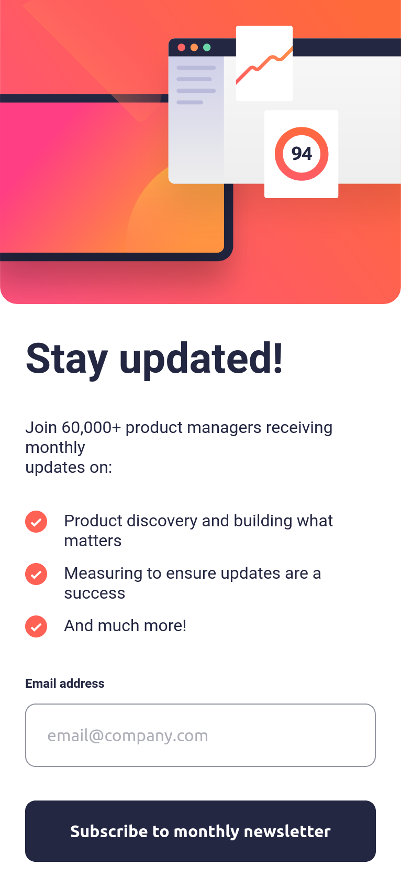
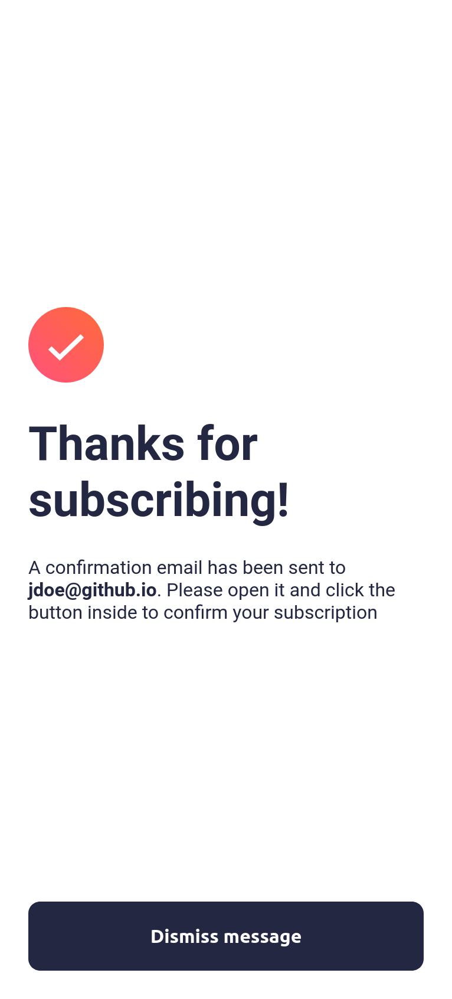
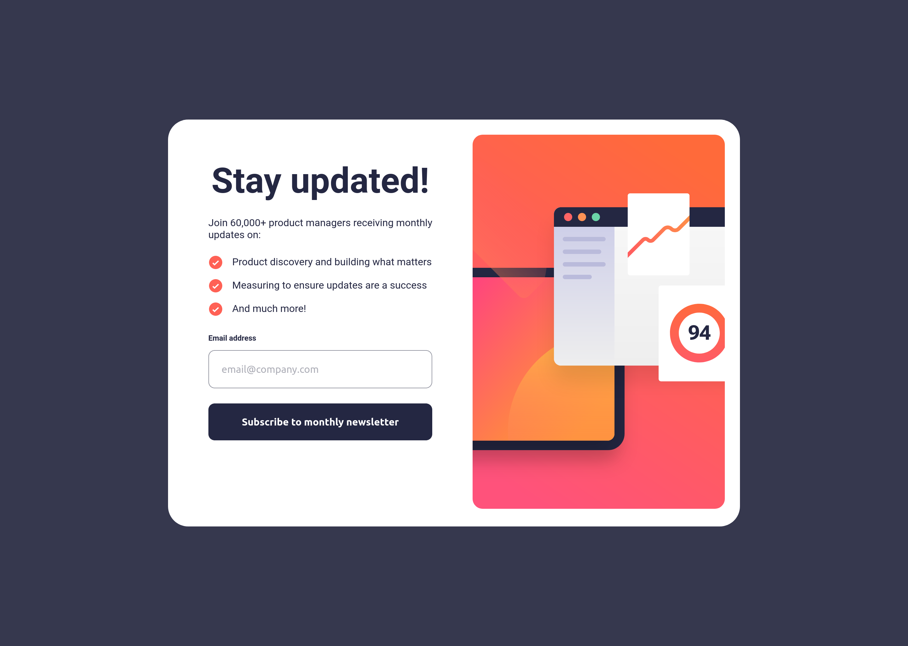
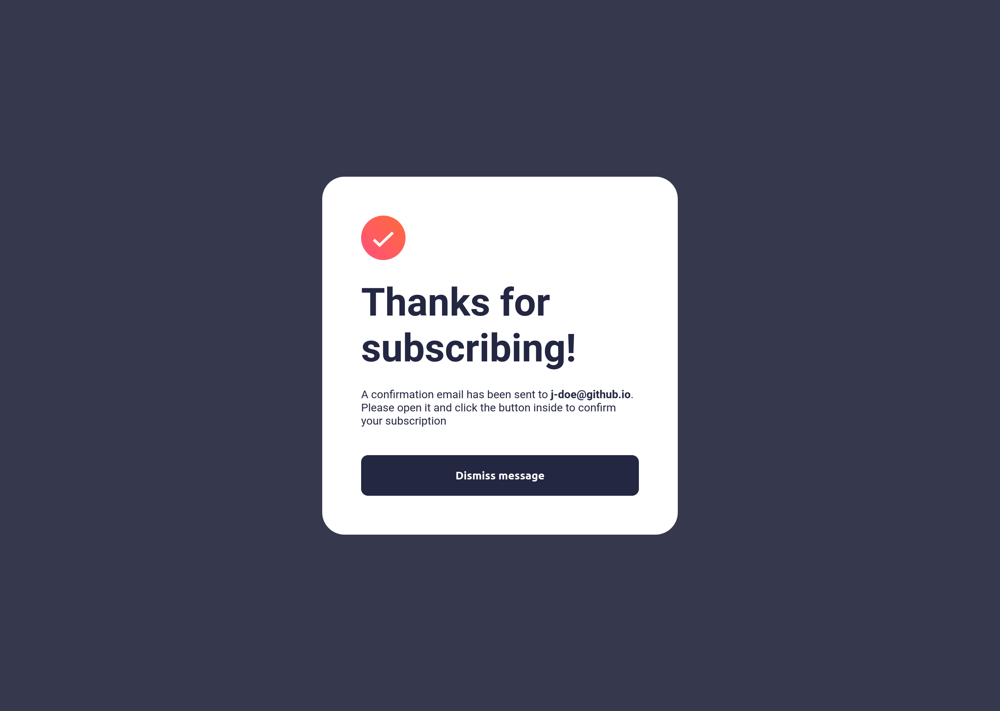

# Frontend Mentor - Newsletter Sign up

This is a solution to the [Newsletter sign up challenge on Frontend Mentor](https://www.frontendmentor.io/challenges/newsletter-signup-form-with-success-message-3FC1AZbNrv). Frontend Mentor challenges help you improve your coding skills by building realistic projects.

## Overview

### Screenshot

  
  

### Links

- Live Site URL: [Github Pages](https://h-mihail.github.io/fe-mentor-newsletter-sign-up/)

## My process

### Built with

- Semantic HTML5 markup
- CSS custom properties
- Flexbox
- Mobile-first workflow
- [Preact](https://preactjs.com/) - JS library
- [Vite](https://vitejs.dev/) - Frontend utility
